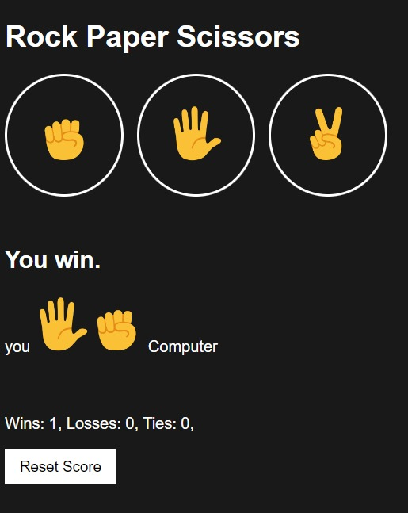

# Rock Paper Scissors

A small project that allows you to play rock paper scissors games against the computer.

## Screenshots

### Per provarlo [clicca qui!](https://mrmax01.github.io/rock-paper-scissors/)
## 🛠 Skills
Javascript, HTML, CSS

## Description
**Algorithm:**
- Waits for the user to choose a move with a click on one of the buttons

- On click (onclick) the computer chooses a random number(x) 0<=x <1 (Math.random()).
If the random number is included:
- 0 <= x < 1/3 pc uses 'rock' move
- 1/3 <= x <2/3 pc uses 'paper' move
- 2/3 <= x < 1 PC uses the move 'scissors' 

*this will determine the computer's move.*

Finally calculate the result, update the page with the new score and save the score in localStorage.
## Authors

- [@Massimo](https://www.github.com/MrMax01)

